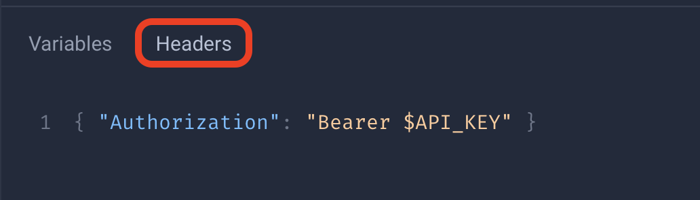

# About

This repository contains a Python script to walk through the Railway Projects and Deployments available for a personal API key, allowing you to download the deployment logs for the selected `Project > Deployment` in order to proceed with further troubleshooting deployment issues from the logs.

## Minimum Requirements

- Python3
- Railway Project(s) and Deployment(s)
- Railway personal API key

## Quickstart

1. Download `get_deployment_logs.py`.
2. Run the `get_deployment_logs.py` Python script by executing command-line execution `python3 /PATH/TO/get_deployment_logs.py`
3. Enter personal API key from your Railway account when prompted, it should attempt to fetch the available Railway Projects for that API key
4. Enter the id of the Project of your choice to see the available Deployments when prompted, it should attempt to fetch the available Railway Deployments for that Project
5. Enter the id of the Deployment of your choice to download the deployment logs when prompted, it should attempt to fetch and pipe the deployment logs to a file (formatted: `DEPLOYMENT_ID_YEAR_MONTH_DAY_HOUR_MINUTE_SECOND.txt`)

Example:


## GraphQL Queries

I made heavy use of Railway's [GraphiQL playground](http://railway.app/graphiql) to explore the schema, in order to utilize this to explore yourself you will need to add your API key to the `Header` section in the GraphiQL web UI:



### Get Projects (`Query.projects`)

```graphql
query getProjects{
  projects {
    edges {
      node {
        name
        id
      }
    }
  }
}
```

### Get Deployments (`Query.deployments`)

```graphql
query getDeployments{
  deployments(input: {projectId: "$PROJECT_ID"}) {
    edges {
      node {
        staticUrl
        id
        status
      }
    }
  }
}
```

### Get Deployment Logs (`Query.deploymentLogs`)

```graphql
query getDeploymentLogs{
  deploymentLogs(deploymentId: "$DEPLOYMENT_ID") {
    timestamp
    severity
    message
  }
}
```

## Documentation Referenced

- [Railway Docs - Getting Started](https://docs.railway.app/getting-started)
- [Railway Docs - Public API](https://docs.railway.app/reference/public-api)
  - [Authentication](https://docs.railway.app/reference/public-api#authentication)
  - [Examples](https://docs.railway.app/reference/public-api#examples)
- [Railway Docs - Projects](https://docs.railway.app/develop/projects)  
- [Railway Docs - Deployments](https://docs.railway.app/deploy/deployments)
  - [Logs](https://docs.railway.app/deploy/deployments#logs)
- [Railway Docs - Priority Onboarding](https://docs.railway.app/reference/priority-boarding)  
- [Geeks for Geeks - Python requests – POST request with headers and body](https://www.geeksforgeeks.org/python-requests-post-request-with-headers-and-body/)
- [Geeks for Geeks - GET and POST Requests in GraphQL API using Python requests](https://www.geeksforgeeks.org/get-and-post-requests-in-graphql-api-using-python-requests/)
- [Graphql - Introduction to GraphQL](https://graphql.org/learn/)
